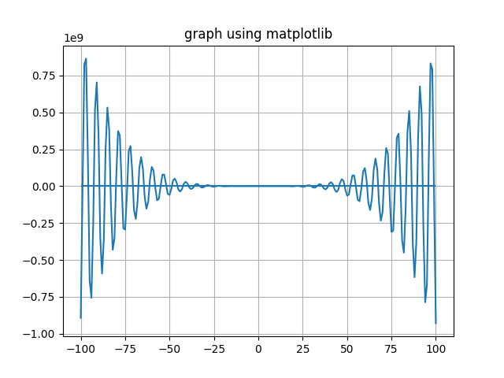

f(x) = -12x^4*sin(cos(x)) - 18x^3+5x^2 + 10x - 30
## 1. Определить корни
У данной функции бесконечное множество корней
## 2. Найти интервалы, на которых функция возрастает
Данная функция возрастает на бесконечном множестве интервалов
## 3. Найти интервалы, на которых функция убывает
Данная функция убывает на бесконечном множестве интервалов
## 4. Построить график

## 5. Вычислить вершину
Данная функция имеет бесконечное множество вершин
## 6. Определить промежутки, на котором f > 0
Количество промежутков на которых f>0 бесконечное множество
## 7. Определить промежутки, на котором f < 0
Количество промежутков на которых f<0 бесконечное множество
